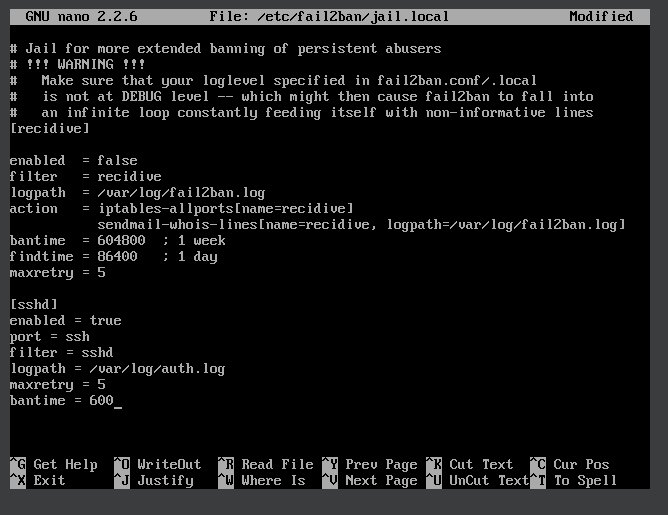
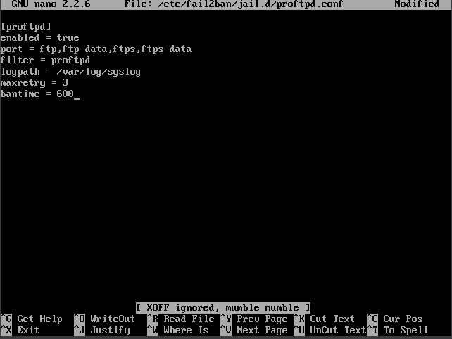
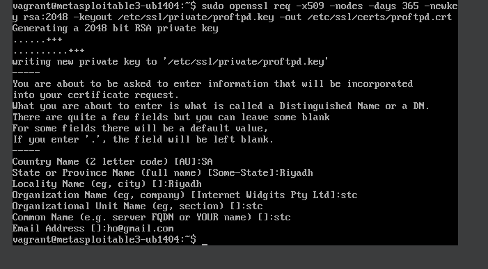
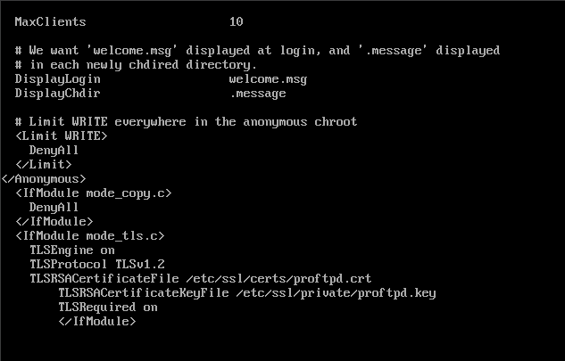
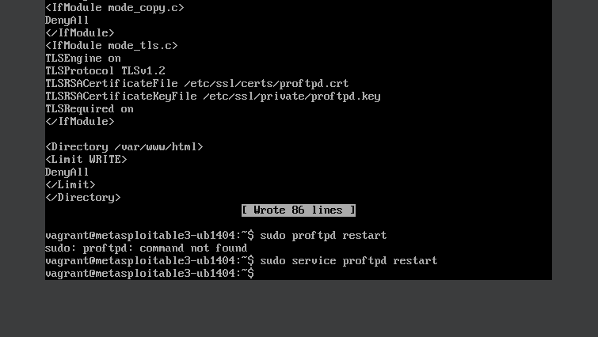
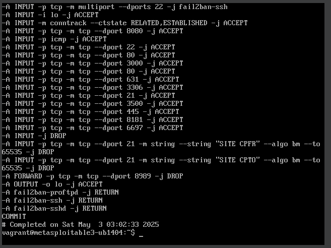
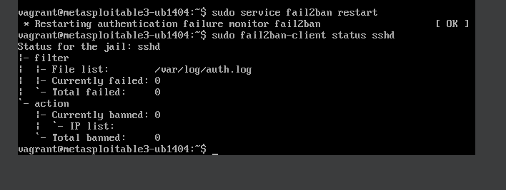
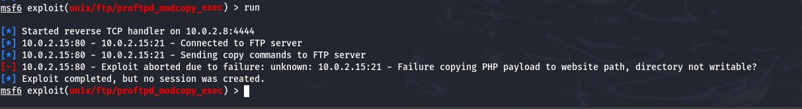

# Phase 3: Defensive Strategy Implementation

This folder contains all configuration changes, screenshots, and validation steps taken to defend the ProFTPD service on the victim machine after the initial compromise.

---

## 3.1 Create Fail2Ban Jail for ProFTPD

1. Added a new jail configuration to `/etc/fail2ban/jail.local`:

   

2. Created a dedicated `proftpd` jail file under `/etc/fail2ban/jail.d/proftpd.conf`:

   

3. Restarted Fail2Ban and verified the jail status:

   ```bash
   sudo service fail2ban restart
   sudo fail2ban-client status proftpd
   ```

---

## 3.2 Generate SSL Certificates for ProFTPD

1. Generated a new self‐signed certificate and key:

   ```bash
   sudo openssl req -x509 -nodes -days 365 \
     -newkey rsa:2048 \
     -keyout /etc/ssl/private/proftpd.key \
     -out /etc/ssl/certs/proftpd.crt
   ```

2. Screenshot of the key generation process:

   

---

## 3.3 Modify ProFTPD Configuration for Secure FTP

1. Opened `/etc/proftpd/proftpd.conf` and applied the following changes:

   * Disabled the `mod_copy` module to prevent arbitrary file writes.
   * Enabled TLSv1.2 with the newly created certificate and key.
   * Restricted write permissions in the web root.

   
   

2. Restarted ProFTPD service:

   ```bash
   sudo service proftpd restart
   ```

---

## 3.4 Remove Execute Permissions from the Web Directory

Revoked all execute bits under `/var/www/html` to prevent execution of uploaded payloads:

```bash
sudo chmod -R a-x /var/www/html
```

Screenshot:


---

## 3.5 Configure Firewall Rules

1. Added iptables rules to drop unauthorized FTP commands and restrict external access:

   

2. Verified rules persistence and ordering as shown above.

---

## 3.6 Retest the Exploit and Validate Defense

1. **Before defense** – exploit still succeeds:

   

2. **After defense** – exploit aborted, directory no longer writable:

   

---

**Outcome:**

* Fail2Ban now automatically bans repeated ProFTPD login failures.
* Self-signed TLS prevents plain‑text credentials and encrypts control channel.
* Execution disabled in web root, payload uploads cannot execute.
* Firewall blocks unwanted FTP commands.
* Post‐defense retesting confirms the service is no longer compromiseable via `mod_copy` exploit.

*End of Phase 3 README.*

